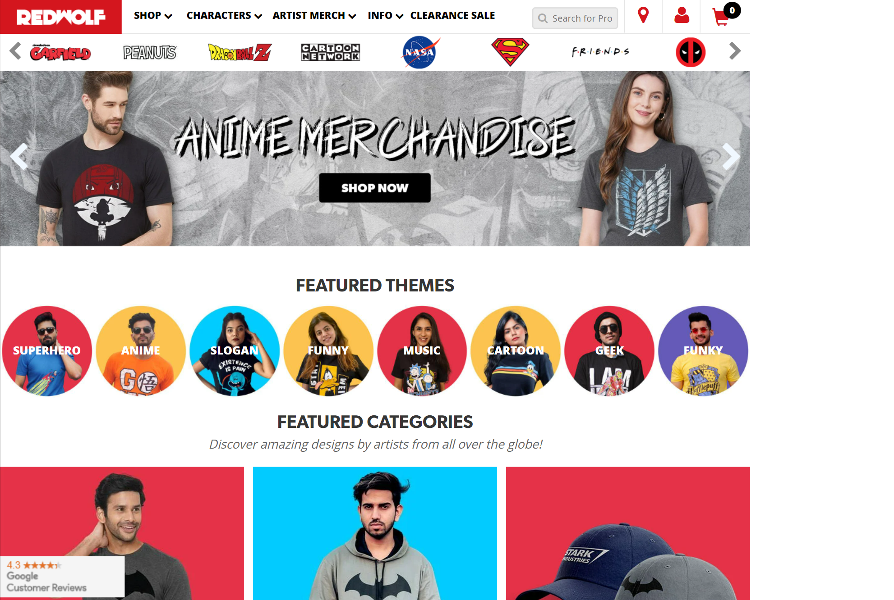

# Sonu Paikrao🎭

A `HTML, CSS Red Wolf | Sonu Paikrao Project.` Project. Made with ♥ by the Sonu Paikrao.This is a landing page. In this project we gonna learn how we can create a website using simple `HTML, CSS`. The main purpose of the project is to get more used to with HTML, CSS & JavaScript. Although we used a few lines of JavaScript in the project for necessary cases. Later on, in this project, we gonna learn how we can deploy this site using `Netlify`. Also, we gonna learn the process from the zero to end and make the website ready for live production.

## What we are going to learn

- HTML, CSS
- JavaScript
- CSS Grid
- Scroll Animation
- More . . .

## Starter files

You can find all the starter files in `starter_files` branch. You can to go to the `starter_files` branch and `download zip` the the starter files or You can clone the project and git checkout to `starter_files` branch.

## Requirements

- Basic HTML, CSS

## Developer teams of Sonu Paikrao

One Man Show 🥰

## Tools Used

1. icons - (flat & Feather icons)
2. UI Design: Figma
3. Code Editor: VS Code

## Contributing

Contributions are always welcome! 👇

See `contributors` branch for ways to get started.
